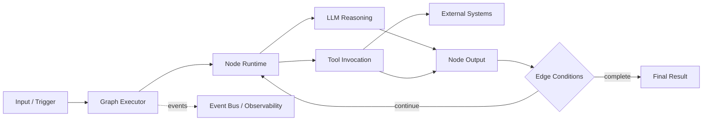

# Hive Architecture Overview

Hive is a Python 3.11+ framework for building long-running, goal-driven AI agents.
It combines a graph-based runtime (`core/framework`) with tool integrations (`tools/src`) so agents can reason, call external systems, and evolve over time.

## Core Building Blocks

- **Graph executor**: Runs node-based workflows and controls transitions between nodes.
- **Agents**: Concrete workflows defined as graphs, typically scaffolded from templates.
- **Tools (MCP-style capabilities)**: External capabilities exposed to nodes (APIs, data systems, file/process operations).
- **Runtime + event bus**: Captures execution events for observability, debugging, and human-in-the-loop experiences.

## How the Graph Executor Works

At runtime, Hive executes one node at a time and routes outputs across graph edges.
Each node receives structured input, performs work (LLM call, tool call, validation, or routing), then emits output used by downstream nodes.

High-level flow:

1. Load/compile graph definition.
2. Initialize runtime state and event stream.
3. Execute active node.
4. Evaluate edge conditions and route to next node(s).
5. Continue until terminal conditions are met.

## How Agents, Tools, and Protocols Connect

- Agent nodes rely on runtime protocols for logging, storage, and event publication.
- Nodes invoke tools through the framework/tool interfaces exposed in `core/framework/tools` and `tools/src/aden_tools`.
- Tool execution outputs are fed back into node conversations and influence subsequent graph transitions.

## Directory Map (Practical)

- `core/framework/graph/` — graph runtime and conversation state
- `core/framework/runtime/` — execution runtime + stream/event integrations
- `core/framework/tools/` — framework-side tool abstractions
- `tools/src/aden_tools/` — concrete tool implementations and registrations
- `examples/templates/` — reference agent templates

## Related Docs

- [Getting Started](./getting-started.md)
- [Developer Guide](./developer-guide.md)
- [Key Concept: Graph](./key_concepts/graph.md)
- [Architecture deep dive](./architecture/README.md)
